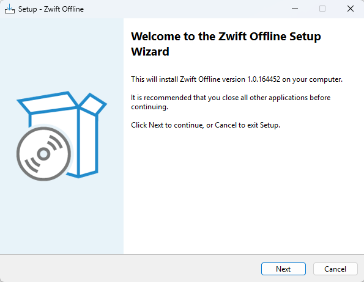
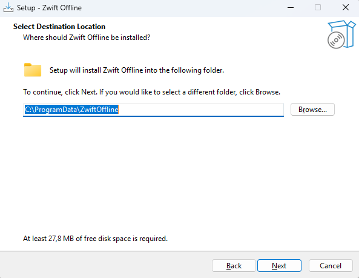
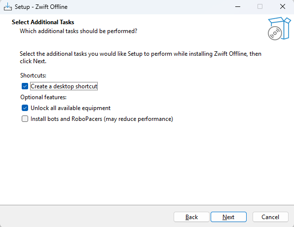
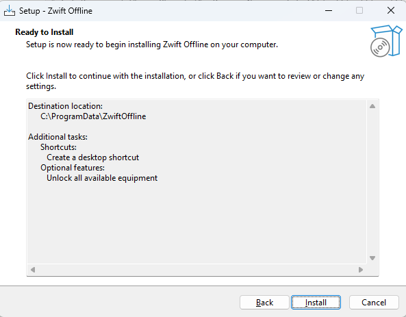
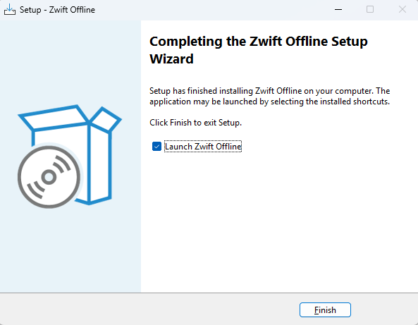

# Zwift Offline One-Click Setup

A free and open-source Windows setup for running the official Zwift client locally with zoffline. No active Zwift subscription is required for local offline use, and the package contains no personal profiles, credentials, activity history, or integration tokens.

## Requirements

- Windows 10 or Windows 11, 64-bit
- An administrator account
- The official Zwift client installed from [zwift.com/downloads](https://www.zwift.com/downloads)
- Zwift game build `1.0.164452`

The setup checks the installed Zwift build before making changes. If the build does not match, setup stops and shows the detected version.

## Installation

1. Double-click `ZwiftOfflineSetup-1.0.164452.exe`.
2. Approve the Windows User Account Control prompt.
3. If Microsoft Defender SmartScreen appears, select **More info**, verify the file name and checksum supplied with the package, and then select **Run anyway**.
4. Select **Next** on the welcome page.



5. Keep the recommended installation folder, `C:\ProgramData\ZwiftOffline`, and select **Next**.



6. Choose the optional features and select **Next**.



   - **Create a desktop shortcut** adds a `Zwift Offline` shortcut.
   - **Unlock all available equipment** enables the full local garage and is selected by default.
   - **Install bots and RoboPacers** is optional and may reduce performance on slower computers. The included bot multiplier is `1`.

7. Review the summary and select **Install**.



8. Leave **Launch Zwift Offline** selected and select **Finish**.



## First Launch

Start the game from the **Zwift Offline** desktop shortcut, not from the normal Zwift shortcut. The shortcut starts the local server first and then opens the official Zwift Launcher.

The first login creates a brand-new local profile. For single-player use, enter an email address and password for this local profile. These credentials remain on this computer and are not copied from the package.

Local progress is stored in:

```text
C:\ProgramData\ZwiftOffline\storage
```

## What Setup Changes

Setup makes only the changes required to route Zwift to the local server:

- Installs the local server in `C:\ProgramData\ZwiftOffline`
- Adds clearly marked Zwift host entries to the Windows hosts file
- Installs the bundled local TLS certificate when it is not already present
- Adds a clearly marked certificate block to Zwift's `cacert.pem`
- Adds private-network firewall rules for the local server
- Creates Start menu and optional desktop shortcuts

The uninstaller removes the system changes created by this package. Local profile and progress data in the `storage` folder are deliberately preserved so they can be backed up or reused. Remove that folder manually only if the data is no longer needed.

## Troubleshooting

### Unsupported Zwift version

This package supports build `1.0.164452`. Install the matching official Zwift client build before running setup. A newer or older build can be incompatible with this server package.

### The launcher was already open

Close Zwift and Zwift Launcher completely, then use the **Zwift Offline** shortcut again.

### The server does not start

Check these files:

```text
C:\ProgramData\ZwiftOffline\install.log
C:\ProgramData\ZwiftOffline\start-zwift-offline.log
```

Also confirm that no other application is using TCP ports `80`, `443`, or `3025`, or UDP port `3024`.

### Reinstalling or moving progress

Back up the entire `storage` folder before uninstalling or moving the installation. Copy it back only to another compatible Zwift Offline installation.

## Privacy

The package contains no personal profile, login, Strava cookie, Intervals.icu credentials, TrainingPeaks credentials, TrainerRoad credentials, activity history, or integration token. Third-party service connections must be configured separately by the person using the installation.

## Source and License

Zwift Offline is an open-source community project. The corresponding source snapshot is distributed as `zwift-offline-source.zip`. Project source: <https://github.com/zoffline/zwift-offline>

See `SOURCE.md` and `LICENSE-zoffline.txt` for source and license information.
